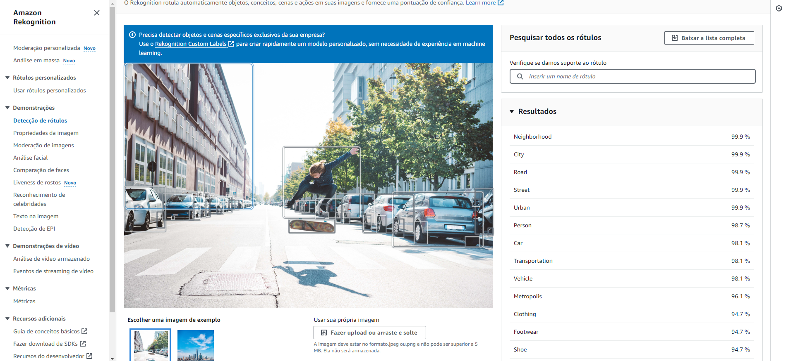
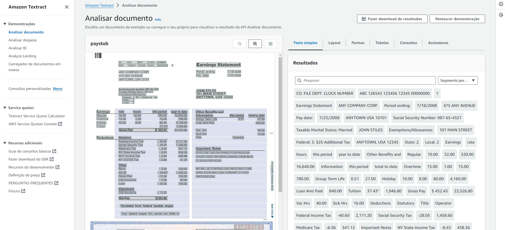
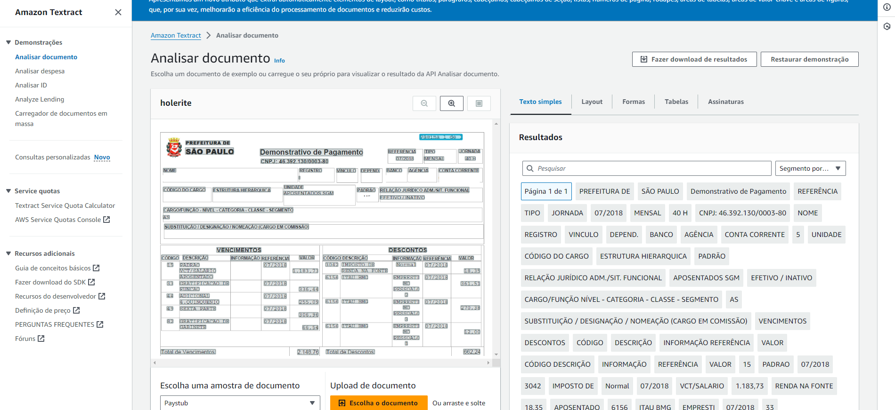

# **Relatório sobre Tarefas de Processamento de Imagem**

## Reconhecimento de Objetos

### Descrição

O reconhecimento de objetos é uma tarefa de visão computacional que envolve identificar e categorizar objetos específicos em imagens digitais. Essa tarefa não se limita apenas à detecção de objetos, mas também à sua classificação em categorias predefinidas, utilizando tecnologias avançadas como redes neurais convolucionais (CNNs) e técnicas de aprendizado profundo para melhorar a precisão e a eficiência do processo.

### Possíveis aplicações

- Segurança e Vigilância: Detecção de comportamentos suspeitos e monitoramento contínuo em tempo real.
- Automotivo: Sistemas de assistência ao condutor para identificação de pessoas e obstáculos, crucial para carros autônomos.
- Varejo: Implementação de sistemas de checkout automatizados em lojas, eliminando a necessidade de caixas humanos.
- Robótica: Navegação e interação de robôs em ambientes complexos através do reconhecimento de objetos e obstáculos.

### Produtos comerciais

**Amazon Rekognition:** Este serviço de análise de imagem e vídeo da AWS pode identificar objetos, pessoas, textos, cenas e atividades, além de detectar conteúdos inadequados, oferecendo uma ampla gama de aplicações de segurança a marketing.

### Segmentos de mercado

- Segurança e Vigilância
- Indústria Automotiva
- Comércio Varejista
- Tecnologia Robótica

### Teste de um Produto

Acessando o painel da AWS, temos a oportunidade de fazer o upload de uma imagem, e ter uma lista de objetos reconhecidos pela ferramenta: 

Na imagem acima, podemos ver um dos exemplos que o sistema entrega, onde é possível ver que ele identificou corretamente objetos como o skate, o skatista, os carros, suas rodas, o prédio, etc. 

Nesta imagem retirada do google, eu desafiei a ferramenta para detectar um animal camuflado, e ela conseguiu com êxito. 

## Extração de Texto

### Descrição

A extração de texto consiste em identificar e converter texto de imagens ou documentos digitalizados para formato digital editável, utilizando tecnologias de Reconhecimento Óptico de Caracteres (OCR). Este processo permite a transformação de informação visual em dados textuais processáveis, facilitando a gestão eletrônica de documentos.

### Possíveis aplicações

- Digitalização de Documentos: Transformação de documentos físicos em formatos digitais para facilitar o arquivamento e a pesquisa.
- Processamento Legal e Financeiro: Extração automatizada de informações críticas de documentos jurídicos e financeiros para análise e processamento rápido.
- Acessibilidade: Conversão de textos impressos para formatos acessíveis para pessoas com deficiência visual.
- Tradução: Utilização do texto extraído em ferramentas de tradução automática para conversão de documentos entre idiomas.

### Produtos comerciais

- AWS Textract: Este serviço de OCR da AWS extrai textos, tabelas e outras informações de documentos digitalizados sem a necessidade de configuração manual ou templates específicos, ideal para uma variedade de aplicações empresariais e pessoais.

### Segmentos de mercado

- Jurídico
- Financeiro
- Educativo
- Tecnologia de Acessibilidade

### Teste de um produto

Acessando o AWS textract, somos introduzidos a uma fatura exemplo

É possível ver que as escritas estão destacadas, sendo possível de clicar e interagir com as palavras detectadas. 

Também realizei um teste com um documento exemplo da prefeitura de São Paulo, e tudo foi detectado perfeitamente. 